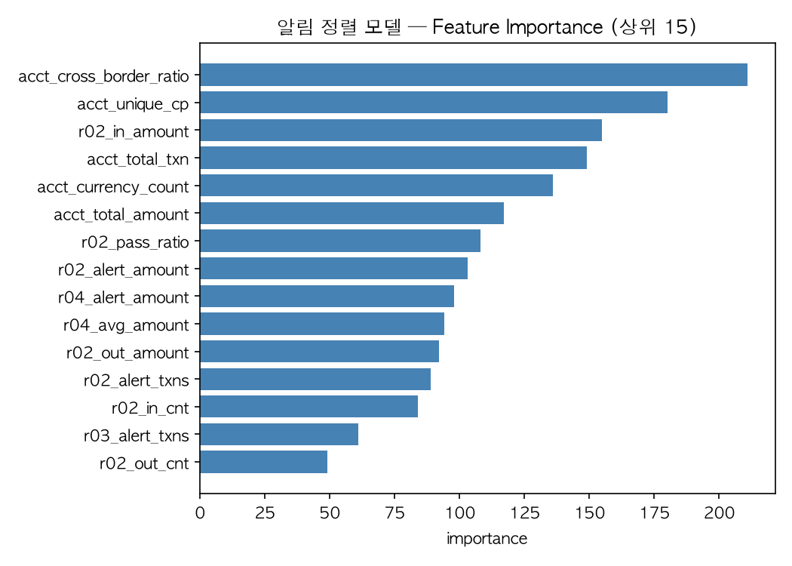

# AML Transaction Monitoring System

[](https://aml-monitoring-cometkim.streamlit.app)

**[▶ 라이브 데모](https://aml-monitoring-cometkim.streamlit.app)** — 탐지 현황 대시보드, 알림 리스트·상세, STR 초안 생성까지 브라우저에서 바로 확인할 수 있습니다.

특정금융정보법·업무규정 조문을 실행 가능한 탐지 룰로 번역하고,
각 룰의 임계값이 오탐률에 미치는 영향을 정량 측정한
자금세탁방지(AML) 거래모니터링 엔진입니다.

> **핵심 결과**: CTR 법정 기준액을 그대로 적용한 베이스라인(알림 44,362건,
> 진성 12건, 정밀도 0.03%) 대비, 최종 순환거래 탐지 룰은 알림 138건으로
> 정밀도 58.70%를 달성했습니다. **알림을 321분의 1로 줄이면서
> 실제 의심거래 포착은 6.75배 늘었습니다.**

---

## 왜 이 프로젝트인가

AML 부서의 실제 문제는 "탐지하지 못하는 것"이 아니라
**"너무 많이 탐지하는 것"**입니다. 룰을 느슨하게 걸면 알림이 수만 건
쏟아지고, 심사 인력은 한정되어 있어 진짜 의심거래가 오탐 속에 묻힙니다.
그래서 실무 KPI는 탐지율이 아니라 **오탐 감축률**입니다.

이 프로젝트는 그 문제를 데이터로 직접 검증합니다.
- 법정 기준(금액)만 보는 룰과 거래 구조(관계·순환)를 보는 룰의
  성능 차이를 같은 데이터, 같은 정답셋으로 비교했습니다.
- 매 단계에서 "왜 이 조건을 넣었고, 왜 뺐는지"를 진단 과정과 함께 기록했습니다.
- 튜닝으로 해결되는 한계와 해결되지 않는 한계를 구분했습니다.

**시의성**: 2026년 3월 입법예고된 특금법 시행령 개정안은 금액 단일
기준으로 의심거래를 보고하도록 해, 업계는 보고 대상이 6만여 건에서
544만여 건으로 늘 수 있다고 추산했습니다. 이 프로젝트가 검증한
"금액 단일 기준의 한계"는 가설이 아니라 진행 중인 정책 논쟁입니다.

---

## 핵심 발견

```
금액 기준 룰(CTR)     →  정밀도  0.03%
관계 기준 룰(통과계좌) →  정밀도  3.94%
관계 기준 룰(국경간)   →  정밀도 28.28%
구조 기준 룰(순환거래) →  정밀도 58.70%
```

**금액을 볼수록 못 잡고, 거래 구조를 볼수록 잘 잡습니다.**
금액은 위장하기 쉽습니다(기준액 바로 아래로 나누면 그만입니다).
구조는 위장하기 어렵습니다 — 돈을 돌리려면 실제로 계좌를 거쳐야 하고,
그 흔적이 거래 그래프에 남습니다.

R-04(국경간 고액거래) 실험에서는 세탁 거래가 CTR 기준액($10,000)
주변에 금액을 맞추는 정황도 관찰했습니다 — 기준액을 2만 달러로 올리면
진성의 89%가 사라지고, 5천 달러로 낮추면 진성이 40% 더 잡힙니다.

---

## 결과 요약

| 룰 | 근거 조문 | 알림 | 진성(전체) | 정밀도(전체) | 기저율 대비 |
|---|---|---:|---:|---:|---:|
| BASE-01 (CTR 법정 기준, 무튜닝) | 특금법 §4의2 / 시행령 §8의2① | 44,362 | 12 | 0.03% | 0.24배 |
| R-01 분할입금 (Structuring) | 위와 동일 | 56 | 0 | 0.00% | 0배 |
| R-02 자금통과계좌 (Mule Account) | 업무규정 의심거래유형 | 13,667 | 539 | 3.94% | 34배 |
| R-04 국경간 고액거래 (EDD 대상) | 업무규정 EDD 대상거래 | 923 | 261 | 28.28% | 246배 |
| **R-03 순환거래 (Cycle)** | 업무규정 의심거래유형 | **138** | **81** | **58.70%** | **510배** |

기저율(전체 거래의 실제 자금세탁 비율) = 0.115%

**정답 패턴 매칭 기준 (R-02·R-03만 가능 — 정답 계좌 라벨 보유)**

| 룰 | 정답 유형 | 정답 계좌 수 | 재현율 | 정밀도(패턴 매칭) |
|---|---|---:|---:|---:|
| R-02 | STACK·FAN-IN·GATHER-SCATTER·SCATTER-GATHER | 1,990 | 16.7% | 2.4% |
| R-03 | CYCLE | 271 | 26.9% | 52.9% |

> 두 정밀도 지표의 차이: **전체 정밀도**는 알림에 걸린 거래 중
> 자금세탁 라벨이 하나라도 있으면 진성으로 계산합니다.
> **패턴 매칭 정밀도**는 그 룰이 목표로 하는 정확한 유형(CYCLE 등)의
> 계좌와 일치하는지만 봅니다. 후자가 더 엄격한 기준입니다.

R-01·R-04는 대응하는 개별 패턴 라벨이 없어 재현율을 측정할 수 없고,
전체 정밀도(알림량 대비 진성 포착)만 평가합니다.

---

## 탐지 룰 4종

### R-01 분할입금 (Structuring)
```
근거 : 특금법 제4조의2 / 시행령 제8조의2 제1항 (고액현금거래보고)
조건 : 1거래일 합산 ≥ 기준액($10,000)
       AND 개별 거래 전부 기준액 미만
       AND 근접거래(기준액 50% 이상) 2건 이상
```
CTR 보고를 회피하려고 기준액 미만으로 쪼개 넣는 패턴입니다.
탐지 결과 진성 0건으로, 이는 룰의 실패가 아니라 **데이터의 자금세탁
라벨이 전부 이체 기반 그래프 패턴에 부여되어 현금 분할입금 시나리오
자체가 존재하지 않기 때문**입니다. 이 결과 자체가 금액 단일 기준의
한계를 보여주는 대조군입니다.

### R-02 자금통과계좌 (Pass-through / Mule Account)
```
근거 : 업무규정상 의심거래 유형 (자금 이동 경로 은닉)
조건 : 72~120시간 슬라이딩 윈도우 내
       유입 집중(상대방 3명↑) + 고속 유출 + 유출 상대방 분산
```
여러 계좌에서 자금이 집중 유입된 뒤 짧은 시간 안에 다시 여러 계좌로
분산 유출되는 패턴(대포통장의 전형적 형태)입니다.
전체 기간 합산 방식(초기 구현)은 재현율 0.3%에 그쳤으나, 정답 계좌와
전체 계좌의 지표 분포가 사실상 동일하다는 진단을 거쳐 슬라이딩
윈도우로 전환해 **재현율을 40배(0.3%→12.5%) 개선**했습니다.

### R-03 순환거래 (Cycle)
```
근거 : 업무규정상 의심거래 유형 (자금 출처 은닉)
조건 : 길이 3~10 순환 경로
       AND 경로상 금액 편차 50% 이내
       AND 30일 이내 완료
```
자금이 여러 계좌를 거쳐 최초 계좌로 되돌아오는 패턴으로, 자금세탁
3단계 중 반복(layering)의 전형적 형태입니다. 448만 건 규모의 거래를
방향 그래프로 변환한 뒤, 가지치기(순환 불가 노드 반복 제거)로 노드를
98.6% 축소하고, 강한 연결 요소(SCC) 단위로 분할해 탐색 범위를
좁혀 실용적인 실행 시간을 확보했습니다. **전체 룰 중 최고 성능.**

### R-04 국경간 고액거래
```
근거 : 업무규정상 강화된 고객확인(EDD) 대상 거래
조건 : 국경 간 거래 AND 금액 ≥ 기준액($10,000)
```
원안은 FATF 고위험 관할권 거래 탐지였으나, 데이터의 국가 구성이
전부 주요국이어서 탐지 대상이 0건이었습니다. 국경 간 거래로 전환한
근거는 국경 간 거래의 진성 비율이 국내 대비 2.9배 높다는 실측치입니다.
민감도 실험 결과 반복성 조건을 추가하면 알림이 42% 줄지만 진성이
87% 소실되어, **조건 추가 없이 베이스라인 그대로를 최종안으로
채택**했습니다. "룰을 정교하게 만들수록 좋아진다"는 통념이 성립하지
않음을 데이터로 확인한 사례입니다.

---

## 임계값 튜닝 실험

파라미터를 하나씩 변경하며(one-factor-at-a-time) 알림 수·재현율·정밀도의
변화를 측정했습니다. 상세 곡선은 [`docs/threshold_tuning.md`](docs/threshold_tuning.md)
참조.

| 유형 | 파라미터 | 대응 |
|---|---|---|
| 실질 지렛대 | R-02 유입 상대방 수, R-03 금액 편차 허용치 | 트레이드오프 지점 선택 |
| win-win | R-03 최대 순환 길이 (8→10) | 재현율·정밀도 동시 상승 — 확대 채택 |
| 재현율 전용 | R-02 관찰 창 크기 | 정밀도 손실 없이 확대 |
| **무효과** | R-02 통과비율, 최소 유입건수 | 파라미터로 해결 불가 → 7단계 ML 정렬의 근거 |
| 검증 불가 | R-03 순환 완료 기간 상한 | 데이터 기간(18일) 제약으로 회피 실험 자체가 불가 |

> **한계 인식**: 모든 룰은 임계값 기반이라 임계값 바깥에서 의도적으로
> 설계된 거래는 탐지하지 못합니다(예: 순환 기간을 상한 밖으로 늘리는
> 경우). 다만 회피에는 자금 회수 지연·경유 계좌 발각 위험 누적이라는
> 비용이 따르므로, 탐지의 목표는 완전 차단이 아니라 **회피 비용의
> 부과**입니다.


---

## ML 기반 알림 우선순위 정렬

룰 4종이 낸 알림 14,367건을 대상으로 LightGBM 기반 우선순위 모델을
적용했습니다. 원칙은 "룰이 탐지하고 모델은 정렬만 한다" — 새로운
계좌를 찾지 않고 기존 알림의 순서만 정합니다. 모델이 직접 탐지를
수행하면 개별 판단의 근거를 설명하기 어려워 규제상 설명가능성
요건에 저촉될 수 있기 때문입니다.

| 심사 비율 | 알림 건수 | 정밀도 | 재현율 | 기본 대비(lift) |
|---|---:|---:|---:|---:|
| 5% | 215 | 60.0% | 57.1% | 11.4배 |
| 10% | 431 | 37.8% | 72.1% | 7.2배 |
| **20%** | **862** | **20.8%** | **79.2%** | **4.0배** |
| 30% | 1,293 | 14.9% | 85.4% | 2.8배 |
| 50% | 2,155 | 9.6% | 91.6% | 1.8배 |

> **심사 인력을 20%만 투입해도 진성의 79.2%를 포착합니다.**

교차검증 AUC 0.897(±0.017, 5-fold).



Feature importance 상위 5개 중 4개가 룰 히트 여부(flag)가 아닌
계좌 수준 통계(국경간 거래 비율, 고유 거래상대방 수, 총 거래건수,
통화 종류 수)로 나타났습니다. 이는 모델이 개별 룰의 판정을 단순
재현하는 데 그치지 않고, 룰이 보지 않는 계좌 전반의 맥락을 결합해
순위를 매기고 있음을 보여줍니다.

**한계**: 데이터 기간(18일)이 짧아 시간 기반 검증(과거 학습→미래
예측)을 수행하지 못했습니다. 무작위 분할 교차검증으로 대체했으며,
실무 배포 전에는 별도의 시간 기반 검증이 필요합니다.

---

## 심사 화면 · STR 초안 생성

탐지 결과를 심사역이 실제로 쓰는 형태까지 연결했습니다.
**[▶ 라이브 데모](https://aml-monitoring-cometkim.streamlit.app)**

| 화면 | 내용 |
|---|---|
| ① 대시보드 | 룰별 알림 점유율·정밀도, CTR 베이스라인 대비 감축률 |
| ② 알림 리스트 | ML 우선순위 점수 정렬, 룰·고위험 필터 |
| ③ 알림 상세 | 계좌별 판정 근거(evidence), 근거 거래 내역, 순환 경로 시각화 |
| ④ STR 생성 | FIU 별지 제1호 서식 초안 생성 및 마크다운 다운로드 |

STR 초안은 특금법 제4조·시행령 제7조에 따른 6개 항목(보고기관, 거래자,
거래채널, 의심스러운 거래내용, 합당한 근거, 보존자료)을 채우고, 결정일로부터
3영업일의 보고 기한을 함께 표기합니다. 시스템이 채우는 것은 정량적 근거까지이며,
**"의심스러운 합당한 근거"의 정성적 판단과 최종 서명은 보고책임자 몫**으로
비워 둡니다 — 자동 생성물을 그대로 제출하는 것은 규정상 허용되지 않기 때문입니다.

R-03(순환거래) 초안의 거래 내역은 시간순이 아니라 **순환 경로 순서**로
정렬합니다. 순환 경로상의 거래는 시각 순서가 경로 순서와 어긋나는 경우가 있어,
시간순으로 나열하면 자금 이동 경로가 끊겨 보이기 때문입니다.

---

## 데이터

[IBM Transactions for Anti Money Laundering](https://www.kaggle.com/datasets/ealtman2019/ibm-transactions-for-anti-money-laundering-aml) (HI-Small, CDLA-Sharing-1.0)

| 항목 | 값 |
|---|---|
| 원본 거래 | 5,078,345건 |
| 정제 후 거래 | 4,487,133건 (자기계좌 거래 11.64% 제외) |
| 계좌 | 518,581개 |
| 자금세탁 정답 라벨 | 5,166건 (0.115%), 8개 패턴 유형 |
| 기간 | 2022-09-01 ~ 09-18 (18일) |

IBM 리서치가 다중 에이전트 시뮬레이터(AMLSim)로 생성한 합성 데이터입니다.
실제 금융 거래 데이터는 개인정보 문제로 공개되지 않아, AML 탐지
연구에서 널리 쓰이는 벤치마크입니다.

상세 정제 과정과 판단 근거는 [`docs/data_prep.md`](docs/data_prep.md),
데이터 출처·변경 고지·재배포 조건은 [`DATA_LICENSE.md`](DATA_LICENSE.md) 참조.

---

## 데이터 확인으로 폐기·전환한 항목

빠뜨린 게 아니라 데이터를 확인하고 판단해서 제외한 것들입니다.

| 항목 | 사유 |
|---|---|
| 야간집중 거래 탐지 | 시간대 분포가 완전 균등(매시 19.2~19.4만 건) |
| 신규계좌 고액거래 탐지 | 데이터 기간 18일, 개설일 정보 부재로 판정 불가 |
| 휴면계좌 급변 탐지 | 위와 동일 |
| FATF 고위험국 탐지 → 국경간 거래로 전환 | 데이터에 고위험 관할권 자체가 부재 |
| R-04 상대국 분산 조건 | 계좌당 상대국이 예외 없이 1개국으로 확인 |
| R-04 반복성 조건 | 민감도 실험 결과 진성 87% 소실 |

---

## 아키텍처

```
거래 데이터 (parquet)
      │
      ▼
탐지 룰 4종 (R-01~R-04) ── 각 룰은 alerts 공통 스키마로 출력
      │
      ▼
알림 테이블 (계좌 단위, evidence JSON 포함)
      │
      ▼
ML 기반 우선순위 정렬 (완료) ── 룰은 탐지, 모델은 정렬만 수행
      │
      ▼
심사 화면 (Streamlit) ── 대시보드 · 알림 리스트 · 알림 상세
      │
      ▼
STR 초안 생성 (FIU 별지 제1호 서식) ── 보고책임자 검토용 마크다운
```

**설계 원칙**: 탐지는 룰이, 정렬은 모델이 담당합니다. 모델이 직접
탐지를 수행하면 규제상 설명가능성(explainability) 요건에 저촉될
수 있기 때문입니다.

---

## 기술 스택

| 영역 | 사용 기술 |
|---|---|
| 언어·데이터 처리 | Python 3.12, pandas, NumPy, PyArrow |
| 그래프 분석 | NetworkX (SCC 분해, 순환 탐색, 차수 기반 가지치기) |
| 탐색 최적화 | `np.searchsorted` 이분 탐색 기반 슬라이딩 윈도우 |
| ML 정렬 | LightGBM, scikit-learn (5-fold 교차검증), matplotlib |
| 심사 화면 | Streamlit, Plotly (Streamlit Community Cloud 배포) |
| 설정 관리 | YAML 파라미터 외부화 |
| 검증 | 조인 무결성 오류를 `SystemExit`로 강제 차단 |
| 형상 관리 | Git |

---

## 실행 방법

```bash
# 0. 환경 (requirements.txt는 배포용 최소 구성,
#    ML 정렬·튜닝 시각화까지 재현하려면 -dev도 함께 설치)
python -m venv .venv && source .venv/bin/activate
pip install -r requirements.txt -r requirements-dev.txt

# 1. 데이터 정제 (Kaggle 원본을 data/raw/ 에 배치 후)
python src/prepare.py

# 2. 정답셋 구축
python src/parse_patterns.py

# 3. 룰 실행
python src/rules/r01_structuring.py
python src/rules/r02_passthrough.py
python src/rules/r03_circular.py
python src/rules/r04_cross_border.py

# 4. 룰별 기여도 분석
python src/analyze_rules.py

# 5. ML 기반 알림 우선순위 정렬 (② 화면의 점수 생성)
python src/rank_alerts.py

# 6. STR 초안 생성 (룰, 건수)
python src/generate_str.py R-03 3

# 7. 배포용 거래 샘플 갱신 (룰 재실행 시 함께 수행)
python src/make_tx_sample.py

# 8. 심사 화면 실행
streamlit run app.py
```

> **배포 환경 안내**: Streamlit Cloud 등 원격 배포 시, 전체 거래 원장
> (`data/reference/transactions.parquet`, 448만 건 / 119MB)은 용량 때문에
> 리포지토리에 포함하지 않습니다. 대신 알림에 연루된 거래만 추출한 샘플
> (`data/alerts/tx_sample.parquet`, 66.8만 건 / 10MB)로 자동 대체되며,
> **③ 알림 상세·④ STR 생성 기능은 동일하게 작동합니다**
> (알림 근거 거래는 전량 포함되어 있습니다). 로컬에 전체 원장이 있으면
> 그쪽을 우선 사용합니다. 룰을 재실행해 알림이 바뀌면
> `python src/make_tx_sample.py`로 샘플을 함께 갱신해야 합니다.

---

## 리포지토리 구조

```
├── app.py                      # Streamlit 심사 화면 (4종)
├── src/
│   ├── prepare.py              # 데이터 정제
│   ├── parse_patterns.py       # 정답셋 구축
│   ├── alerts.py               # 알림 공통 스키마
│   ├── analyze_rules.py        # 룰별 기여도 분석
│   ├── rank_alerts.py          # ML 기반 알림 우선순위 정렬
│   ├── generate_str.py         # STR 초안 생성 (FIU 별지 제1호)
│   ├── make_tx_sample.py       # 배포용 거래 샘플 추출
│   ├── tune_r02.py ~ r04.py    # 파라미터 민감도 실험
│   ├── plot_tuning.py          # 민감도 곡선 시각화
│   ├── inspect_*.py            # 데이터 탐색 (일회성)
│   └── rules/
│       ├── r01_structuring.py
│       ├── r02_passthrough.py
│       ├── r03_circular.py
│       └── r04_cross_border.py
├── config/thresholds.yaml      # 룰 파라미터
├── requirements.txt            # 배포 환경 의존성 (최소 구성)
├── requirements-dev.txt        # 전체 파이프라인 재현용 (ML·시각화)
├── docs/
│   ├── data_prep.md            # 데이터 정제 근거
│   ├── threshold_tuning.md     # 튜닝 실험 결과 및 곡선
│   ├── img/                    # 민감도 곡선 (7종)
│   └── *.csv                   # 실험 원시 데이터
└── data/
    ├── raw/                    # 원본 (Kaggle, 리포 제외)
    ├── reference/              # 정제 데이터·정답셋 (리포 제외)
    ├── alerts/                 # 룰별 알림 결과 + 배포용 거래 샘플
    └── str_drafts/             # STR 초안 산출물
```

---

## 한계

- 합성 데이터 기반입니다. 실무에서는 정답 라벨이 없어 심사 결과를
  사후 라벨로 사용해야 합니다.
- 계좌 국가는 은행명 접두어에서 추출했으며, 49.16%는 미국 지명
  기반 추정입니다(`country_source` 컬럼으로 판정 근거 구분 보존).
- 원본에 잔액 컬럼이 없어 R-02의 자금 통과 여부를 유입·유출 합계로
  근사합니다.
- 데이터 기간이 18일이라 계좌 연령·휴면 여부 기반 탐지는 구현할 수
  없습니다.
- R-01·R-04는 대응하는 세부 패턴 라벨이 없어 알림량·정밀도만
  측정했습니다.
- 임계값 기반 탐지 전반의 구조적 한계로, 임계값 바깥에서 설계된
  거래는 탐지하지 못합니다.

---

## 향후 계획

- [x] ML 기반 알림 우선순위 정렬 (Precision@20% = 20.8%, 재현율 79.2%)
- [x] Streamlit 심사 화면 ([라이브 데모](https://aml-monitoring-cometkim.streamlit.app))
- [x] STR 초안 자동 생성 (FIU 별지 제1호 서식)

---

## 라이선스

코드와 데이터에 서로 다른 라이선스가 적용됩니다.

| 대상 | 라이선스 |
|---|---|
| 소스 코드·문서 | [MIT](LICENSE) |
| 파생 데이터 (`data/alerts/*.parquet`) | [CDLA-Sharing-1.0](CDLA-Sharing-1.0.txt) |

원본 데이터는 IBM Corporation이 CDLA-Sharing-1.0으로 배포한 합성 데이터이며
이 저장소에 포함되어 있지 않습니다. 출처·변경 고지·재배포 조건은
[`DATA_LICENSE.md`](DATA_LICENSE.md)를 참조하십시오.
