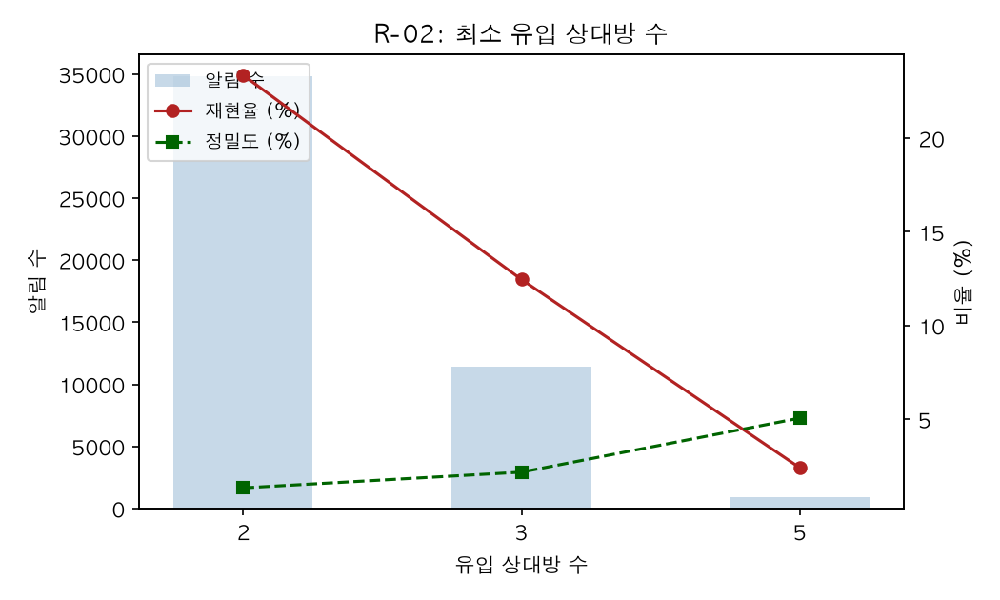
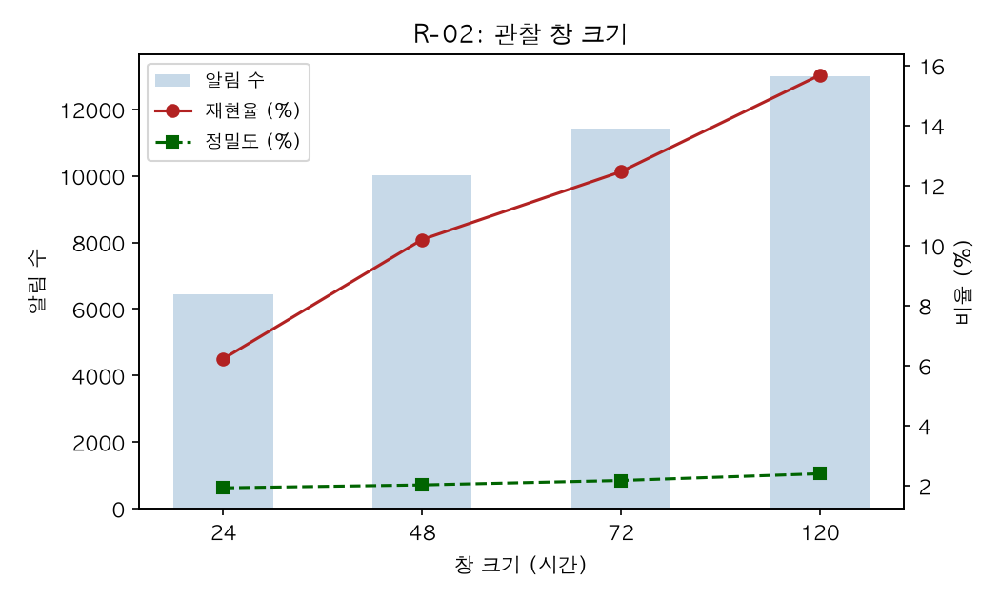
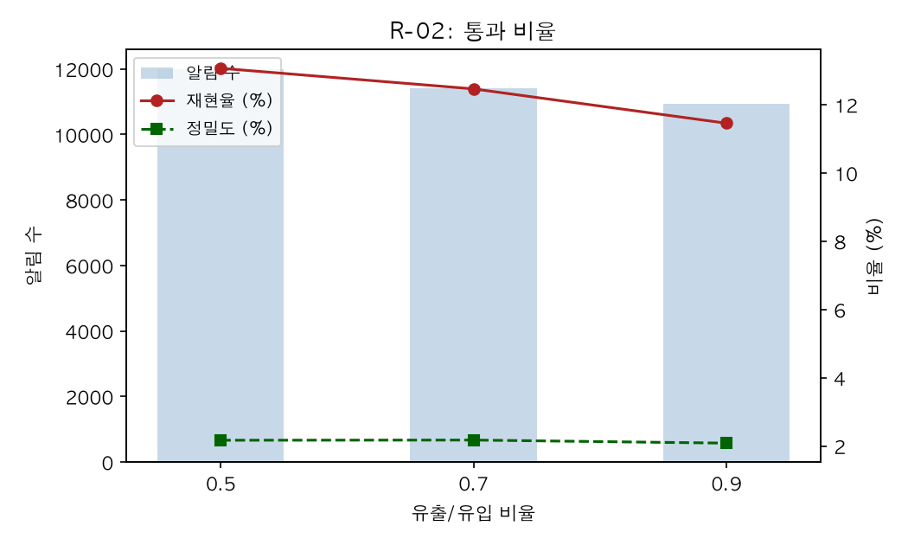
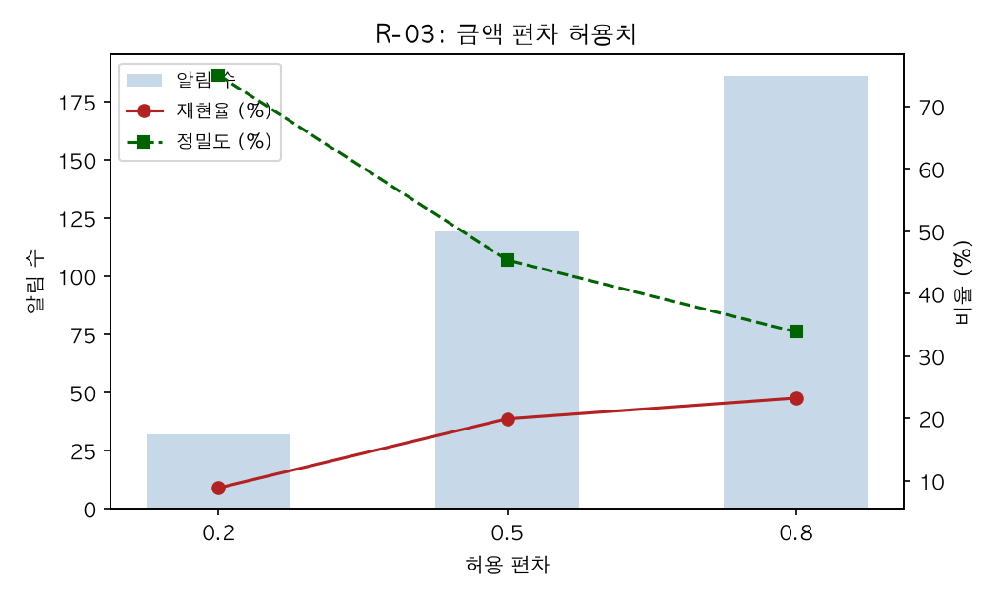
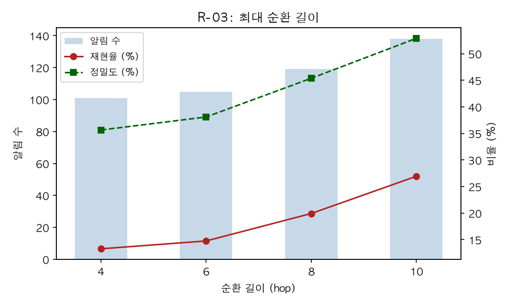
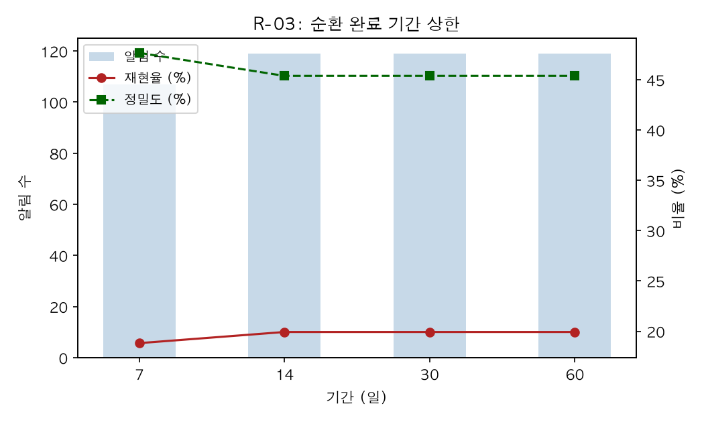
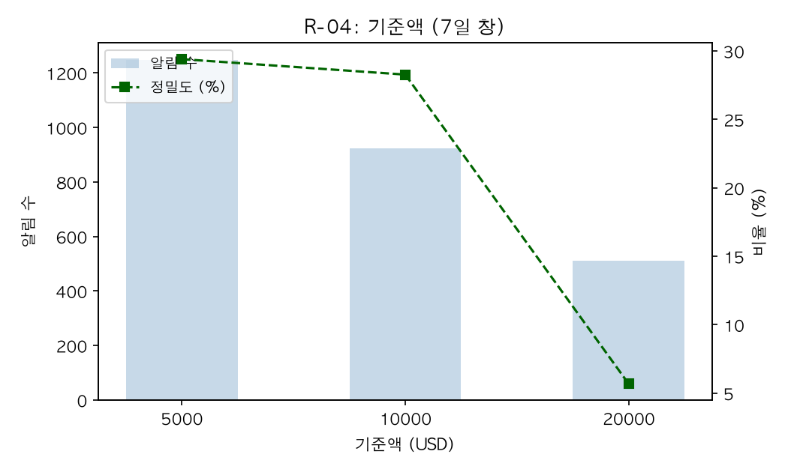

# 임계값 민감도 실험

> 방식: one-factor-at-a-time — 확정 기준 설정에서 파라미터 하나씩만
> 변경해 (알림 수, 재현율, 정밀도)의 변화를 격리 측정.
> 원시 데이터: r02_tuning.csv / r03_tuning.csv / r04_tuning.csv

## 확정 설정 요약

| 룰 | 변경 | 근거 |
|---|---|---|
| R-02 | window_hours 72→120, pass_ratio 0.7→0.5 | 재현율 +4.2%p, 정밀도 유지 |
| R-03 | max_len 8→10 | 재현율·정밀도 동시 개선 (희귀한 win-win) |
| R-04 | 변경 없음 (기준액 $10,000 유지) | 법정 기준(CTR) 준거 |

---

## R-02 자금 통과 계좌

### 유입 상대방 수 — 유일한 실질 지렛대

| min_in_parties | 알림 | 재현율 | 정밀도 |
|---|---|---|---|
| 2 | 34,823 | 23.4% | 1.3% |
| 3 | 11,409 | 12.5% | 2.2% |
| 5 | 949 | 2.4% | 5.1% |

2→5에서 알림이 37배 차이. 유일하게 정밀도를 유의미하게 움직이는
파라미터다. 2는 심사 불가능한 알림량, 5는 재현율이 룰로서 성립하지
않는 수준(2.4%)이라 3을 유지한다.

### 관찰 창 크기 — 재현율만 증가

24→120시간에서 재현율 6.2%→15.7%, 정밀도는 1.9%→2.4%로 거의 불변.
창을 넓히면 진성과 오탐이 같은 비율로 늘어난다. 정밀도 손실이 없으므로
120으로 확대 채택.

### 통과 비율 — 효과 없음

0.5~0.9 전 구간에서 정밀도 2.1~2.2% 고정. 이 조건은 진성과 오탐을
구분하지 못한다. 정답 계좌와 전체 계좌의 지표 분포가 동일하다는
5단계 진단과 일치하는 결과. 파라미터로 해결되지 않는 한계이며,
개선하려면 피처 추가(7단계 ML 정렬)가 필요하다.

---

## R-03 순환거래

### 금액 편차 허용치 — 가장 깨끗한 트레이드오프 곡선

| tolerance | 알림 | 재현율 | 정밀도 |
|---|---|---|---|
| 0.2 | 32 | 8.9% | 75.0% |
| 0.5 | 119 | 19.9% | 45.4% |
| 0.8 | 186 | 23.2% | 33.9% |

조이면 정밀도 75%까지 오르지만 재현율이 8.9%로 무너진다.
전형적인 트레이드오프이며 0.5가 절충점.

### 최대 순환 길이 — 희귀한 win-win

| max_len | 알림 | 재현율 | 정밀도 |
|---|---|---|---|
| 4 | 101 | 13.3% | 35.6% |
| 8 | 119 | 19.9% | 45.4% |
| 10 | 138 | 26.9% | 52.9% |

8→10에서 재현율과 정밀도가 동시에 상승했다. 긴 순환일수록 우연이
아니라 의도된 세탁이라 정밀도까지 오른다. 데이터의 CYCLE 패턴이
"Max 12 hops"로 생성된 것과 일치 — 8로 자르면 9~10홉 순환을 통째로
놓친다. 10으로 확대 채택. 실행 시간 증가 없음(9초).

### 순환 완료 기간 — 회피 실험

| 기간 상한 | 진성 | 증분 |
|---|---|---|
| 7일 | 51 | — |
| 14일 | 54 | +3 |
| 30일 | 54 | +0 |
| 60일 | 54 | +0 |

14일 이후 추가 탐지가 없다. 본 데이터의 세탁 순환이 전부 14일 안에
완료되기 때문이다(데이터 기간 18일 제약).

**한계 명시**: 임계값 회피(순환 기간을 상한 밖으로 연장)에 대한 룰의
취약성은 이 데이터로는 검증 불가능하다. 실무에서는 다층 임계값 병행과
파라미터 주기 갱신으로 보완하며, 회피에는 자금 회수 지연과 경유 계좌
발각 위험 누적이라는 비용이 따른다.

---

## R-04 국경 간 고액거래

### 기준액 — 세탁 거래의 금액대 집중

| 기준액 | 알림 | 진성 | 정밀도 |
|---|---|---|---|
| $5,000 | 1,248 | 367 | 29.41% |
| $10,000 | 923 | 261 | 28.28% |
| $20,000 | 510 | 29 | 5.69% |

두 가지 발견:

1. **$20,000 초과 세탁 거래가 거의 없다** — 기준액을 2만으로 올리면
   진성의 89%가 소실된다.
2. **$5,000~10,000 구간에 진성이 상당하다** — 기준액을 5천으로 낮추면
   진성 40%를 더 잡고 정밀도도 유지된다(29.4%).

종합하면 세탁 거래가 기준액($10,000) 주변에 금액을 맞추고 있다는
정황이다. R-01이 현금에서 찾지 못한 기준액 회피 행태가 국경간
이체에서 간접 관찰된다.

**기준액은 $10,000 유지** — 법정 기준(CTR) 준거가 룰의 근거이기
때문이다. 기준액 인하 시나리오($5,000)는 2026년 시행령 개정 논쟁
(금액 단일 기준의 보고량 폭증 문제)과 연결되는 분석으로 별도 기록한다.

---

## 종합 — 파라미터 유형 분류

| 유형 | 해당 파라미터 | 대응 |
|---|---|---|
| 실질 지렛대 | R-02 min_in_parties, R-03 tolerance | 트레이드오프 지점 선택 |
| win-win | R-03 max_len | 확대 채택 |
| 재현율 전용 | R-02 window_hours | 정밀도 손실 없으면 확대 |
| 무효과 | R-02 pass_ratio, min_in | 파라미터로 해결 불가 — ML 피처로 이관 |
| 검증 불가 | R-03 max_duration_days | 데이터 한계로 명시 |

튜닝의 결론: **파라미터 조정으로 얻을 수 있는 것과 없는 것이 구분되었다.**
R-02의 정밀도 2%대는 임계값의 문제가 아니라 지표 자체의 변별력 한계이며,
이것이 7단계 ML 알림 정렬의 존재 이유다.
